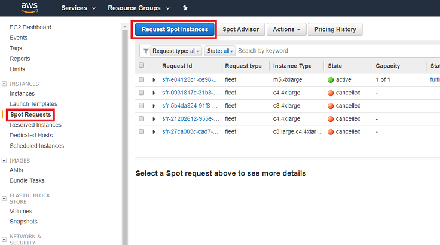
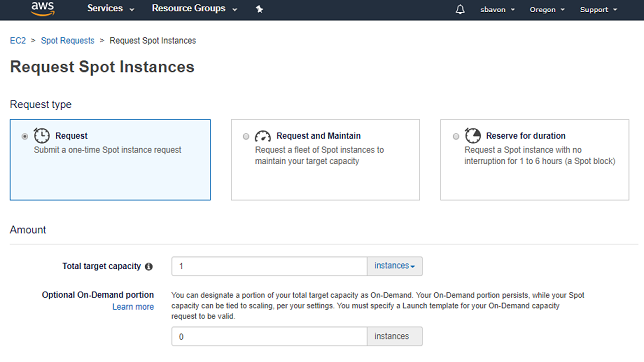
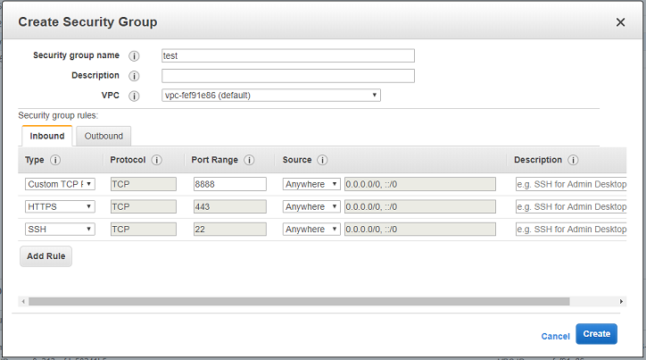
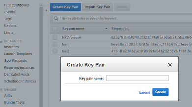
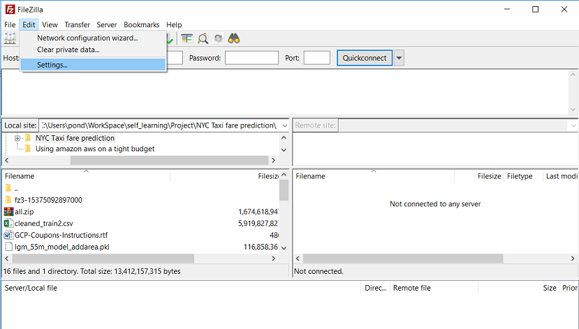
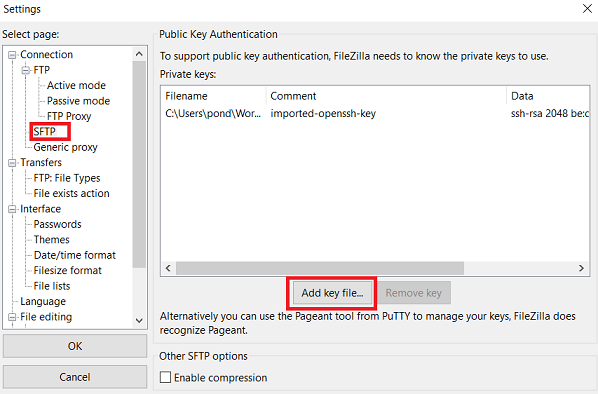
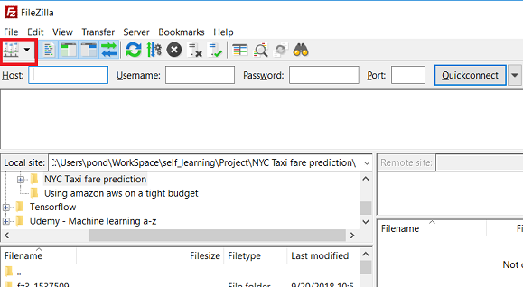
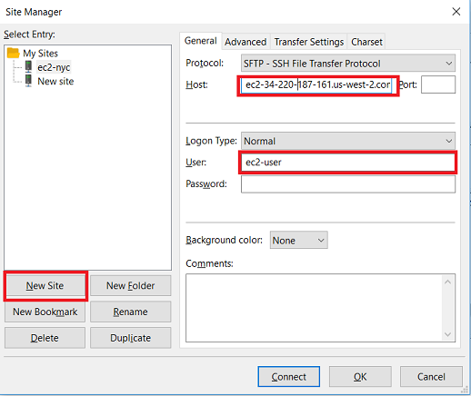
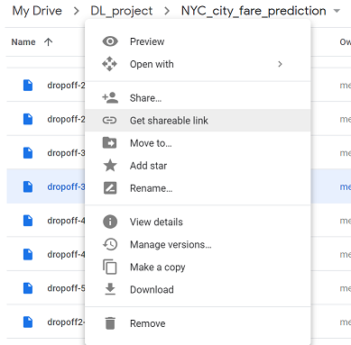
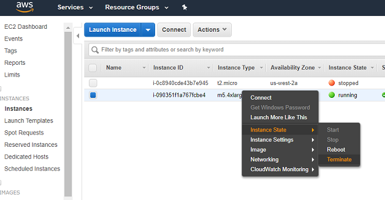

# Use Amazon EC2 to train a machine learning model on a budget (by using Spot Instance)

In this tutorial, I will walk through how to leverage Amazon EC2 to train the machine learning model in an inexpensive way. With a tight budget, I use this approach to work with Kaggle competition and to experiment deep learning techniques. The tutorial is suitable for a person who uses Windows.


## Step 0: Prepare everything you need in your local system

To save up cost, you need to make everything ready for training before launching an EC2 instance.
The files you need to prepare may include, but not limited to, training data, ipython script, and a list of dependencies. 
So, when you launch the instance, you can jump into training with less extra works.

## Step 1: Request EC2 Spot instance

The reason I use Spot instance is because it is much more cheaper by 60-70%. 
However, unlike an on-demand instance, the spot instance does not allow you to stop and resume it when needed. 
Therefore, you will be constantly charged since the time you created the instance until the time you terminated it. 
That's why, you need to make sure everything is ready before using it.

To get start, register the AWS, and log in to your EC2 dashboard. Click "spot requests", and then "Request Spot Instances". A new configuration page will show up

*EC2 dashboard*




*Configuration page*



You will see that there are many fields in this page, but normally, I will leave most of them as they are. Except the fields belows:

* `AMI`: I choose Ubuntu 14.04 or Linux. But it is up to you to choose software configuration
* `EBS volume`: I change the size to 30GB, which is in the free-tier 
* `Security group`: This will enable you to remote connect to this instance. If you have never created security group before, you need to create a new one:
	1. click `create new security group` on the right. It will direct to the new page. Then click `create security group` 
	
		
		
		
		
	2. Add name and description. Select inbound tab, insert rules following the image below, and then click "create"
	
		
		
	3. go back to the configuration page, and select the security group that you just created

* `Key pair name`: If you don't have any previous key-pair, you should create a new one following below instructions
	1. click `create new key pair`. It will direct to the new page. click `Create key pair`
	2. fill in the key name and click `create`. It is important to save the key for later use.
		
		

* `Maximum price`: select `Set your max price (per instance/hour)` and set the maximum price you want to pay
	
	

After finish configuration, click `launch`. You will see your new instance in instance tab in EC2 dashboard

## Step 2: Connect to the instance

After creating the new instance, we need to setup the environment for training. 
I found that there is a great walkthrough in the internet already. Please follow [this](https://medium.com/@alexjsanchez/python-3-notebooks-on-aws-ec2-in-15-mostly-easy-steps-2ec5e662c6c6)

Apart from installing Anaconda and jupyter, you can install other libraries such as Lightgbm and HDBscan according to your needs 


```
# For example
conda install -c conda-forge lightgbm 
pip install hdbscan
```

## Step 3: Transfer file to the EC2 instance

I normally use **FileZilla** application to transfer file between a local machine and EC2 instance. 
I also use Google Drive to store very large files, and download these files to the instance via Python **gdown** library.

### Transfer file using FileZilla

1. Download the [FileZilla Client](https://filezilla-project.org/), and install the program 

2. Open the program and click setting according to the picture below
	
	

3. Select `SFTP` and `add key file` (You can reuse key file generated in step 1.1) and hit `ok`
	
	

4. Click top-left icon (Open the site manager) and click `New Site`. Fill in the public DNS and user name
	
	
	
	

5. Click `connect`, which will allow you to access the file in your instance

### Download file from Google Drive
1. install `gdown` library

	```
	pip install gdown
	```

2. open jupyter notebook and write this following code
	
	```
	import gdown

	url = 'https://drive.google.com/uc?id=[ID]'
	output = '[filename]'
	gdown.download(url, output, quiet=False)
	```

3. you need to replace [ID] and [filename] in the code above. To obtain the ID, open the google drive, right click on the file, and select `get shareable link` 
	
	

	Then you will get the link, which contain the ID of the document. Make sure that the file is set as **Anyone with the link...**
	
	

4. run the code

After setting up the environment and transferring all files to the instance, it is time for you to run the code to train the model

## Step 4: Save the result and terminate the instance

After training the model, I normally use **pickle** to store the trained model or **tf.train.Saver** to save session for Tensorflow

```
import pickle
with open("myModel.pkl", 'wb') as pickle_file:
  pickle.dump(model, pickle_file)
```

Then I transfer the model back to my local machine through **FileZilla**

Finally, I will clear thing up by terminating the instance to stop charging
	


And that's it. It appears that there are many tasks to setup the environment. 
However, if you are familiar with the process, it can be very fast to setup and you can save your money up to 60-70%!!!

